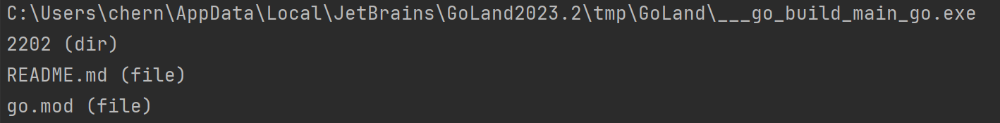
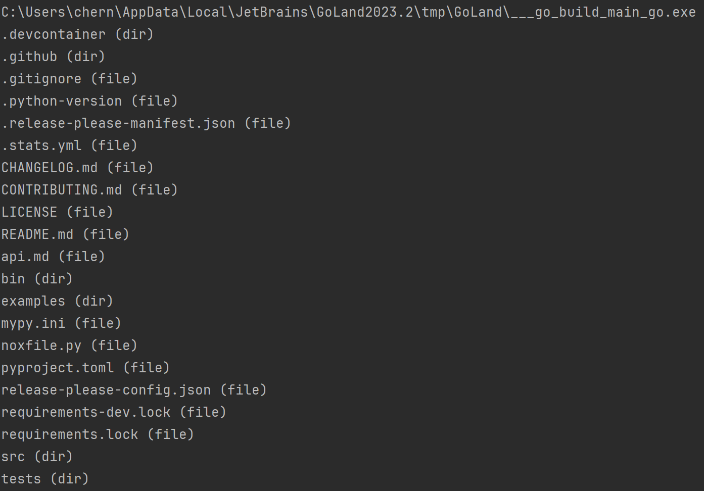

Код делает запрос к репозиторию пользователя и вывоидт все файлы и папки в текущей директории с подписью типа

Результат работы программы при константах:
1. owner = "pedrecho"          
2. repo = "development_management" 
3. path = ""  

Второй запрос сделал к открытому репозиторию openai api для питона:
1. owner = "openai"   
2. repo  = "openai-python"
3. path  = ""
