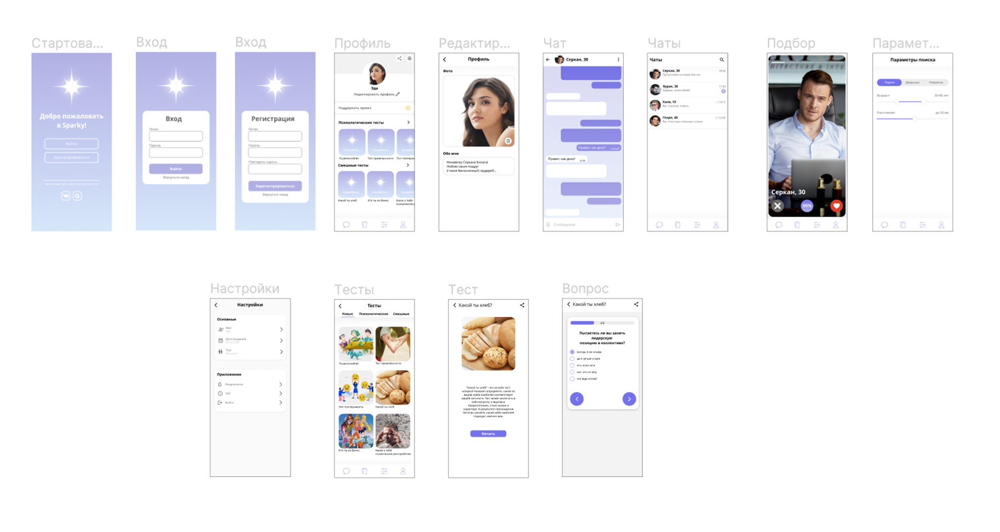

# Лабораторная 2: работа с классификацией видов тестирования
## Цель работы

Провести анализ мобильного приложения для знакомств, написанного на Dart/Flutter, с точки зрения классификации видов тестирования.

## Описание программного проекта

Приложение для знакомств — это мобильное приложение, созданное для помощи пользователям в поиске новых знакомств и общения. Основные функции приложения включают регистрацию и вход, создание и редактирование профиля, психологические и развлекательные тесты, свайпы и мэтчи, а также чаты для тех, у кого совпали лайки. Бэкенд приложения написан на Golang, используется протокол RestAPI для общения клиента и сервера, микросервисы взаимодействуют по gRPC, а база данных PostgreSQL.

## Классификация видов тестирования

1. **Модульное тестирование**
    - Тестирование отдельных модулей, функций или классов приложения. Например, тестирование функции регистрации, компонента профиля пользователя, реализации свайпов или алгоритма мэтчинга.

2. **Функциональное тестирование**
    - Проверка работы всех функций приложения. Например, тестирование регистрации и входа в систему, корректности редактирования профиля, работы психологических и развлекательных тестов, функционирования свайпов и мэтчей, а также чатов.

3. **Тестирование удобства использования**
    - Оценка удобства и интуитивности взаимодействия пользователей с приложением. Например, проведение пользовательского тестирования для оценки интерфейса, анализ отзывов пользователей, A/B тестирование различных решений, проверка адаптивности интерфейса на разных устройствах.

4. **Тестирование с применением анализаторов кода**
    - Использование инструментов статического анализа для проверки качества кода. Например, валидация разметки интерфейса, проверка соответствия кода стандартам, анализ производительности и безопасности.

## Примеры дефектов

1. **Модульное тестирование**
    - Ошибка при регистрации пользователя из-за некорректной работы функции валидации данных.
    - Некорректное отображение информации в профиле пользователя.
    - Неправильное срабатывание алгоритма мэтчинга.

2. **Функциональное тестирование**
    - Невозможность входа в систему после регистрации.
    - Некорректное сохранение изменений в профиле.
    - Психологические тесты не загружаются или выдают ошибки.
    - Ошибки при свайпах и создании мэтчей.
    - Чаты не открываются или сообщения не отправляются.

3. **Тестирование удобства использования**
    - Сложность в навигации по приложению.
    - Некорректное отображение интерфейса на различных устройствах.
    - Неудобное расположение элементов управления.
    - Плохая отзывчивость интерфейса на действия пользователя.

4. **Тестирование с применением анализаторов кода**
    - Ошибки в разметке, приводящие к некорректному отображению контента.
    - Проблемы с безопасностью, такие как уязвимости к SQL-инъекциям.
    - Недостаточная производительность кода из-за неэффективных алгоритмов.

## Выводы по работе

В данной работе было проанализировано мобильное приложение для знакомств на предмет того, как его можно протестировать. Выделены 4 основных способа тестирования: модульное тестирование, функциональное тестирование, тестирование удобства использования и тестирование с применением анализаторов кода. Были также описаны характерные дефекты для каждого вида тестирования.